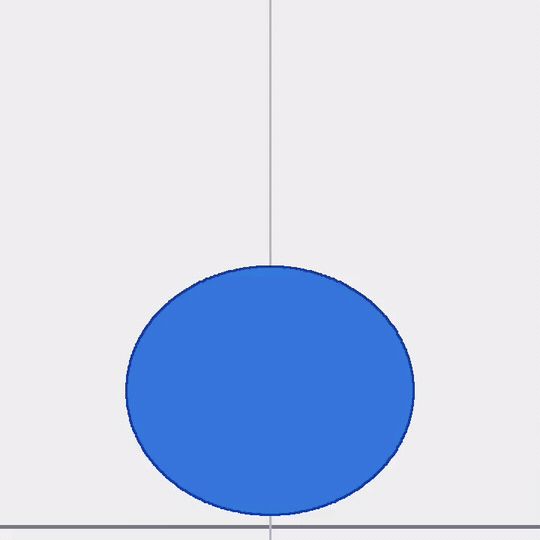
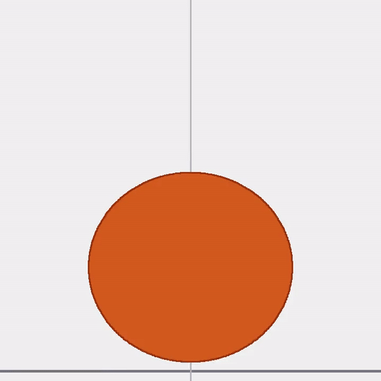

# DropRebound.jl

Julia solver for the impact and rebound of a liquid drop on a flat substrate, with support for Newtonian, viscoelastic (Oldroyd-B), and shear-thinning (Carreau-Yasuda) rheology.

<table>
<tr>
<td align="center" width="50%">



*Oldroyd-B (Oh = 0.30, De₁ = 0.5, β_s = 0.5, We = 0.5, M = 90) — legacy solver*

</td>
<td align="center" width="50%">



*Carreau shear-thinning (Oh = 0.30, λ_c = 0.02, We = 0.5, M = 90) — legacy solver*

</td>
</tr>
</table>

## What it does

A spherical drop falls under gravity, deforms on contact with a solid surface, spreads, then rebounds. The package solves the linearised spectral equations governing that process, and the model is stated **variationally**: three quadratic functionals — kinetic energy, viscous dissipation, and surface energy — with Lagrange's equations giving the evolution.

What distinguishes it from the usual modal treatment is that **the interior flow is part of the state**. The generalised coordinates are the amplitudes of an interior *displacement* stream function, expanded in Gegenbauer functions in angle and in the Taylor powers $x^{l+1}, x^{l+3}, \dots$ of the exact spherical-Bessel profile in radius. The surface amplitudes are its boundary trace; nothing is eliminated. Keeping the interior is what makes the damping exact rather than Lamb's small-viscosity estimate — at the Ohnesorge of the reference experiments, Lamb over-damps by 37% at $l = 2$ and 143% at $l = 8$, and correcting that moves the coefficient of restitution by 16%.

The same structure carries **shear thinning** without further approximation: the viscosity is evaluated pointwise from the shear-rate invariant of the *full* strain field, and because that invariant does not superpose over modes, $\eta$ acquires angular structure and couples the shape modes within a Gaunt band.

Contact is a unilateral constraint. The gap and the film pressure satisfy a complementarity condition, resolved on a set of Legendre-root collocation angles that cluster at the pole where contact forms; the contact extent is a discrete unknown found by an active-set iteration on the two inequalities.

The Julia module name is `DropSolver` (`using DropSolver`).

**Validated** against Gabbard et al. (2025): coefficient of restitution to 8% median, contact time to 13%, across 935 experiments spanning $\mathrm{Oh} \in [0.014, 0.79]$. And against a 3000 ppm shear-thinning solution whose zero-shear Ohnesorge is 57 — a Newtonian drop that viscous does not rebound at all, so the rebound the experiments measure exists *because* the fluid thins. Restitution agrees to 7%, contact time to 10%, with nothing fitted to the impact data.


## Dimensionless parameters

All quantities are non-dimensionalized by the drop radius $R$ and the capillary time $\tau_{\rm cap} = \sqrt{\rho R^3 / \sigma}$ (the natural oscillation period of a free drop). Simulation output times are in units of $\tau_{\rm cap}$.

Three numbers control the Newtonian problem:

| Parameter | Definition | Physical meaning |
|-----------|-----------|-----------------|
| Oh (Ohnesorge) | $\nu\sqrt{\rho/(\sigma R)}$ | Ratio of viscous dissipation to surface-tension restoring force. Oh ≪ 1: nearly inviscid, bounces with little energy loss. Oh ~ 1: heavily damped, may not rebound. |
| Bo (Bond) | $\rho g R^2 / \sigma$ | Ratio of gravitational body force to surface tension. Bo ≪ 1: surface tension dominates, drop stays nearly spherical at rest. Bo ~ 1: gravity flattens the drop significantly. |
| We (Weber) | $\rho v_0^2 R / \sigma$ | Ratio of impact kinetic energy to surface tension. We ≪ 1: gentle impact, drop barely deforms. We ~ 1: vigorous spreading. In the solver, We = v₀² where v₀ is the dimensionless impact velocity set via `init.v`. |

The gravity term in the center-of-mass equation is $-\mathrm{Bo}$ (dimensionless), so `Bo = 0` gives a gravity-free oscillation.

As a reference point: a water–glycerol drop of radius 0.2 mm falling at 9 cm/s gives Oh ≈ 0.30, Bo ≈ 0.019, We ≈ 0.079.

### Viscoelastic drops — the Oldroyd-B model

The Oldroyd-B model describes dilute polymer solutions: a Newtonian solvent of viscosity $\mu_s$ mixed with long elastic polymer chains that contribute an additional viscosity $\mu_p = \mu - \mu_s$. During deformation the chains stretch and store elastic energy; when released they recoil and drive extra rebound — polymer drops can bounce higher and ring longer than equivalent Newtonian drops.

The constitutive law is a convected Maxwell model for the polymer stress combined with a Newtonian solvent. It reduces to Newtonian flow when $\lambda_1 \to 0$ or $\mu_p \to 0$.

Two additional parameters:

| Parameter | Definition | Physical meaning |
|-----------|-----------|-----------------|
| De₁ | $\lambda_1 / \tau_{\rm cap}$ | Deborah number: polymer relaxation time $\lambda_1$ scaled by the capillary time. De₁ ≪ 1: polymer relaxes fast — behavior is nearly Newtonian. De₁ ≫ 1: polymer stores elastic energy across many oscillations — elastic effects dominate. |
| β_s | $\mu_s / \mu$ | Solvent fraction. β_s = 1: purely Newtonian solvent ($\mu_p = 0$). β_s → 0: purely polymeric. Typical polymer solutions: β_s ∈ [0.3, 0.9]. |

Setting `De1 = 0` or `beta_s = 1` recovers Newtonian behavior exactly.

## Installation

```julia
# activate the environment from the repo root
julia --project=julia
```

Or from any Julia session:

```julia
using Pkg
Pkg.activate("/path/to/km-viscous-drop/julia")
using DropSolver
```

Requires Julia 1.12+. No external packages — only `LinearAlgebra` and `Logging` from the standard library.

## Quick start

```julia
using DropSolver

# Newtonian, at the parameters of the Gabbard et al. (2025) production sweep.
# M sets three things at once: shape modes l = 2..M, film-pressure harmonics
# l = 0..M, and M+1 collocation angles — which is what makes the contact
# system square. K is the number of radial trial functions per mode.
p = ImpactParams(We = 1.0, Bo = 0.0189, Oh = 0.3038, M = 45, K = 2)
r = simulate(p)

r.cor          # coefficient of restitution
r.tc           # contact time, in units of √(ρR³/σ)
r.cp           # contact extent (node count) at each step
r.a, r.adot    # interior amplitudes and their rates
r.pc           # film-pressure coefficients

# K = 1 is one trial function per mode — potential flow, hence Lamb damping,
# which is the published Newtonian model. K ≥ 2 resolves the interior and
# recovers Reid's damping exactly. At this Ohnesorge that is a 16% change in CoR.

# Shear thinning: pass η(γ̇)/η₀. Oh is then the ZERO-SHEAR Ohnesorge, and the
# viscosity is evaluated pointwise from the full strain field.
eta = gd -> carreau(gd; lambda_c = 10.0, a = 2.0, n = 0.5, eta_inf_ratio = 0.01)
rst = simulate(ImpactParams(We = 1.0, Bo = 0.0189, Oh = 0.3038,
                            M = 14, K = 2, eta = eta))
rst.eta_sweeps_max    # worst Picard sweep count over the march
rst.eta_resid_max     # worst converged residual; steps that stall are rejected
```

A variable viscosity forces the coupled matrices to be rebuilt every step, so
shear-thinning runs use a smaller `M` than Newtonian ones, where the operator is
block diagonal and built once.

## The four solvers

Two formulations, two contact closures, all four live:

|                    | ranked search   | complementarity    |
| ------------------ | --------------- | ------------------ |
| **variational**    | `simulate`      | `simulate_lcp`     |
| **nonvariational** | `solve_drop!`   | `solve_drop_lcp!`  |

Within a row the two take identical arguments and return identical types, so
switching closures is a one-word change.

All four are kept because a disagreement between any two can then be
attributed: agreement down a column clears the formulation, agreement across a
row clears the closure. Measured over five cases, restitution agrees across
**all four cells to within 0.8 %** — no shared contact logic, same rebound
speed. Contact time is where they part, and only in one place: the closure
changes it by 7.5 % in the variational formulation and by 0.0 % in the
nonvariational one, so that difference belongs to the formulation rather than
to complementarity in general.

Picking one:

- **shear-thinning viscosity** — variational only; the nonvariational
  formulation has no interior state to evaluate `η(γ̇)` against
- **Oldroyd-B** — nonvariational search only; polymer stress makes the system
  non-affine, and `solve_drop_lcp!` refuses those parameters rather than
  quietly solving an approximation
- **exact linear damping with nothing to tune** — nonvariational; Reid's
  coefficients are built in, where the variational solver needs `K ≥ 2`
- **robustness across a sweep** — either complementarity solver; neither can
  reject a step for want of an admissible candidate
- **cross-checking** — run `simulate` against `solve_drop_lcp!`; they share
  neither formulation nor closure

Full tradeoffs, including why the two closures need different LCP algorithms,
are in the *Choosing a Solver* page of the documentation.

### Nonvariational interface

The interface below drives the nonvariational solvers, which eliminate the
interior and advance each surface mode with Reid's exact per-mode coefficients.

```julia
using DropSolver

M  = 20        # Legendre modes — more modes = finer shape resolution
Oh = 0.3038    # Ohnesorge number
Bo = 1/53.9    # Bond number (≈ 0.0186; Bo = ρgR²/σ)

dt_max    = make_dt_max(M)
theta_vec = make_theta_vec(M)
precomp   = precompute_integrals(NaN, M)[1]  # Legendre integral matrix; pass NaN for default grid
cfg       = SimConstants(M, M+1, Oh, Bo, theta_vec, precomp, dt_max)
ob        = OBParams(0.0, 1.0)               # Newtonian; use OBParams(De1, beta_s) for polymer

init    = DropState(M)
init.z  = 1.1      # drop center height (z = 1 means just touching the substrate)
init.v  = -0.281   # impact velocity (dimensionless, negative = falling)
init.dt = dt_max
init.cp = 0        # no contact initially

times, states = solve_drop!(cfg, ob, deepcopy(init); t_end=8.0, save_every=0.05)

# Inspect contact phase
in_contact = filter(s -> s.cp > 0, states)
println("Contact frames:    ", length(in_contact))
println("Peak deformation:  A₂ = ", maximum(s.A[2] for s in in_contact))
```

Switching to a polymer drop:

```julia
ob_poly = OBParams(0.5, 0.5)   # De₁ = 0.5, β_s = 0.5
times_p, states_p = solve_drop!(cfg, ob_poly, deepcopy(init); t_end=8.0, save_every=0.05)

# Polymer stress amplitude at end of contact
last_contact = last(filter(s -> s.cp > 0, states_p))
println("Peak polymer stress S₂ = ", last_contact.S[2])
```

## Logging

The solver uses Julia's standard `Logging` library. By default you see:

- `[ Info]  solve_drop! starting` — parameters and rheology at the start of each run
- `[ Info]  Contact onset` / `Lift-off` — with the exact dimensionless time
- `[ Warn]  dt approaching minimum` — if the solver is struggling numerically

Enable per-step diagnostics (accepted steps, dt halvings, Jacobian cache events):

```julia
ENV["JULIA_DEBUG"] = "DropSolver"
```

Suppress all output:

```julia
using Logging
with_logger(NullLogger()) do
    times, states = solve_drop!(cfg, ob, deepcopy(init); ...)
end
```

## API

### Setup

```julia
make_theta_vec(M)
# → M+1 Gauss-Legendre collocation angles (θ values in (π/2, π], south pole first)

make_dt_max(M)
# → CFL-stable maximum time step: 2π / (√(M(M+2)(M-1)) · 8)

precompute_integrals(NaN, M)[1]
# → (M+1)×(M+1) matrix of ∫Pₙ(u)/u³ du integrals used in the contact pressure block.
#   Pass NaN to use the default internal grid. The [1] selects the integral matrix
#   from the returned (matrix, angles) tuple; only the matrix is needed here.

SimConstants(M, M+1, Oh, Bo, theta_vec, precomp, dt_max)
OBParams(De1, beta_s)   # OBParams(0.0, 1.0) = Newtonian
DropState(M)            # zero-initialized state; set .z, .v, .dt, .cp before use
```

### Solver

```julia
times, states = solve_drop!(cfg, ob, init;
                             t_end      = 10.0,
                             save_every = 0.05,
                             dt_init    = make_dt_max(M),
                             dt_min     = 1e-6)
```

Returns `times::Vector{Float64}` and `states::Vector{DropState}` at each saved frame. The solver adapts the time step automatically and detects contact transitions. It errors with a clear message if the step size falls below `dt_min`.

### State fields

| Field | Type | Description |
|-------|------|-------------|
| `A[n]` | `Vector{Float64}` | Shape amplitudes for Legendre modes n = 2…M (`A[1] ≡ 0` by symmetry) |
| `Adot[n]` | `Vector{Float64}` | Time derivatives $\dot{A}_n$ |
| `S[n]` | `Vector{Float64}` | Polymer stress auxiliary variables (Oldroyd-B only; zero for Newtonian) |
| `B[n]` | `Vector{Float64}` | Pressure amplitudes B₀…Bₘ (length M+1) |
| `z` | `Float64` | Center-of-mass height (z = 1: drop just touching substrate) |
| `v` | `Float64` | Center-of-mass velocity (negative = falling) |
| `t` | `Float64` | Current simulation time (in units of $\tau_{\rm cap}$) |
| `dt` | `Float64` | Time step used to reach this state |
| `cp` | `Int` | Contact point count (0 = airborne, > 0 = in contact) |
| `theta_star` | `Float64` | Continuous contact angle θ* ∈ (π/2, π] (π = no contact; used by `solve_drop_v1!`) |

### Alternative solver

`solve_drop_v1!(cfg, init; ...)` implements the same physics with a continuous contact angle θ* instead of discrete contact points. It is provided for comparison and is not recommended for production runs.

## Showcase scripts

Run from the repo root.

### Viscous decay — Newtonian free oscillation

```bash
julia --project=julia julia/scripts/run_newtonian.jl
```

Excites the $l = 2$ shape mode and extracts the decay rate $\gamma$ and oscillation frequency $\omega$ from the time series, comparing against the Lamb (1932) analytical result at several Ohnesorge numbers.

### Viscoelastic oscillation — effect of polymer stress

```bash
julia --project=julia julia/scripts/run_ob_case.jl
```

Compares $\gamma$ and $\omega$ for Newtonian vs Oldroyd-B at increasing De₁. Shows that polymer elasticity suppresses viscous damping — the drop rings longer.

### Eigenvalue validation

```bash
julia --project=julia julia/scripts/run_eigenvalue_sweep.jl
```

Sweeps (Oh, De₁, β_s) and checks the simulated decay rate and frequency against the exact root of the Oldroyd-B characteristic equation. Errors are below 5% across the parameter space.

### Drop impact — Newtonian vs Oldroyd-B

```bash
julia --project=julia julia/scripts/run_impact.jl
```

Runs both fluid types at $M = 20$ and prints a side-by-side time series of center-of-mass height, contact point count, and leading shape amplitude — showing how polymer stress modifies spreading and rebound.

### Parameter sweep

```bash
julia --project=julia julia/scripts/run_sweep.jl [output.csv]
```

Runs a Cartesian product of (Oh, Bo, We, De₁, β_s, M) and streams results to a CSV file. Each row contains the four KPIs: contact time, coefficient of restitution, maximum spreading radius, and maximum $|A_2|$ deformation. Interrupted runs resume automatically — rows already in the CSV are skipped. Edit the grid constants at the top of the script to change the sweep range.

### Animation

```bash
julia --project=julia julia/scripts/run_animation.jl [output.mp4]
```

Renders a drop-impact simulation as an MP4 video. Frames are rasterized in pure Julia (no plotting packages) and piped as raw RGB24 to `ffmpeg`. Requires `ffmpeg` on `PATH`. The 2D output shows the meridional cross-section of the drop with the substrate at $z = 0$.

## Postprocessing API

```julia
# Reconstruct the drop surface as (xs, zs) Cartesian coordinates
xs, zs = drop_profile(state, cfg; n_theta=200)

# Dimensionless contact-patch radius at a single state
r = compute_contact_radius(state, cfg)

# Extract all KPIs from a completed simulation run
kpis = extract_kpis(times, states, cfg)
# → SweepKPIs(contact_time, cor, max_radius, max_A2)
```

`SweepKPIs` fields:

| Field | Description |
|-------|-------------|
| `contact_time` | Duration of the contact phase in capillary times |
| `cor` | Coefficient of restitution $\sqrt{|E_{\rm out}/E_{\rm in}|}$ |
| `max_radius` | Maximum dimensionless spreading radius during contact |
| `max_A2` | Maximum $|A_2|$ shape amplitude during contact |

All fields are `NaN` / `0.0` when no contact occurs.

## Numerical method

The Legendre spectral expansion is exact for the linearized problem. Key implementation choices:

- **Gauss-Legendre collocation**: angular collocation points are the zeros of $P_M$ plus the south pole. This gives a well-conditioned Vandermonde matrix (condition number ~16 at $M = 20$; uniform spacing gives ~$10^{16}$).
- **CFL time step**: $\Delta t_{\max} = 2\pi / (\sqrt{M(M+2)(M-1)} \cdot 8)$, scaling as $M^{-3/2}$.
- **Jacobian caching**: the linearized system has a constant Jacobian for fixed ($M$, contact state, $\Delta t$, BDF order). $J^{-1}$ is computed once and reused — each time step costs one matrix–vector product.

## Tests

```bash
julia --project=julia -e 'using Pkg; Pkg.test()'
```

148 tests cover: Legendre recursion, BDF coefficients, Newtonian free-oscillation decay and frequency (< 5% vs Lamb), Oldroyd-B eigenvalue parity (< 5% vs characteristic equation), drop impact physics (contact detection, Newtonian vs OB divergence during contact), MATLAB parity KPIs, and postprocessing functions (drop profile, contact radius, KPI extraction).

## License

MIT License. See [LICENSE](LICENSE) for details.

## Reference

> Agüero-Vera et al., *Spectral simulation of viscous drop impact with Oldroyd-B rheology*, in preparation.
> *(arXiv link and DOI will be added upon submission.)*
