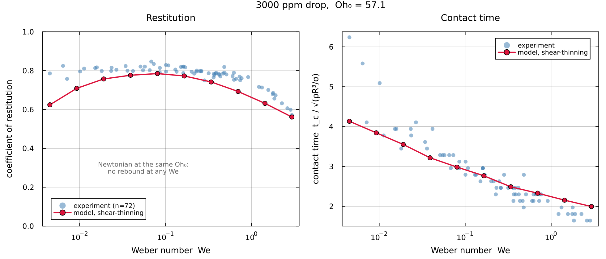
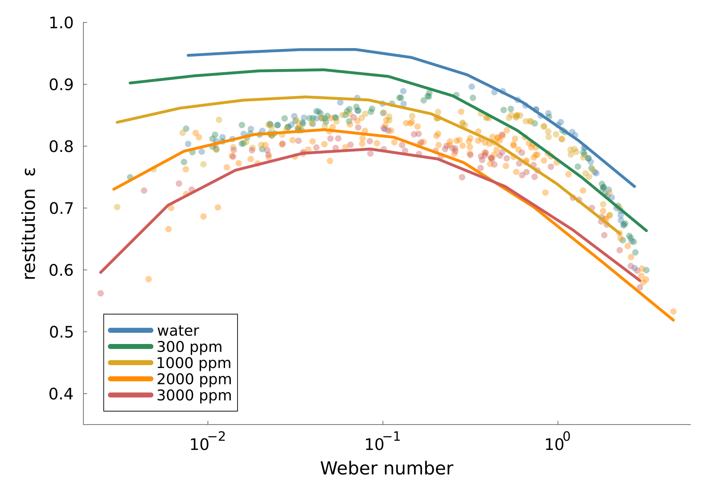

# DropRebound.jl

## The problem

A liquid drop of radius ``R``, density ``\rho``, surface tension ``\gamma`` and dynamic
viscosity ``\eta`` falls onto a rigid, non-wetting surface at speed ``v_0``. It flattens
against the surface, spreads, recoils, and in most cases leaves again. Two numbers summarise
the encounter: how long the drop stays in contact, and what fraction of its downward speed it
recovers.

This package predicts both, for Newtonian, shear-thinning and viscoelastic liquids, by solving
the linearised equations of motion in a spectral basis. Nothing is fitted to impact data. The
fluid is characterised by rheometry, the geometry by three dimensionless groups, and the
outcome follows.



## Governing equations

Inside the drop the flow obeys the incompressible Navier-Stokes equations. Nothing is
approximated here: the linearisation this package uses is a separate step, introduced below and
kept separate deliberately, because the variational machinery does not need it.

```math
\rho\bigl(\partial_t \bm u + \bm u\cdot\nabla\bm u\bigr) \;=\; \nabla\cdot\bm\Sigma + \rho\bm g ,
\qquad
\bm\Sigma = -p\,\bm I + 2\eta(\dot\gamma)\,\bm e ,
\qquad
\bm e = \tfrac12\bigl(\nabla\bm u + \nabla\bm u^{\mathsf T}\bigr) ,
\qquad
\nabla\cdot\bm u = 0 ,
```

with ``\dot\gamma = \sqrt{2\,\bm e\!:\!\bm e}`` the shear rate.

Two things about how this is written. The stress appears as ``\nabla\cdot\bm\Sigma`` rather than
as ``-\nabla p + \eta\nabla^2\bm u``, because the two agree only for a **uniform** viscosity:
``\nabla\cdot(2\eta\bm e) = \eta\nabla^2\bm u + 2\,\bm e\cdot\nabla\eta``, and for the
shear-thinning fluids this package treats, that second term is the physics. And ``\eta`` is
written as a function of the shear rate from the outset, since a constant viscosity is the
special case rather than the starting point.

The flow and the interface are assumed **axisymmetric** throughout, so a single polar angle
``\theta`` describes the surface. That assumption is not lifted anywhere in this package.

Write ``\Omega`` for the region the liquid occupies and ``\partial\Omega`` for its free
surface, at ``r = R + \zeta(\theta,t)``. Every integral below is over one of these two. The
conditions on ``\partial\Omega`` carry the physics:

```math
\underbrace{\partial_t\zeta = \bm u\cdot\bm n\,\sqrt{1+|\nabla_s\zeta|^2}}_{\text{kinematic}} ,
\qquad
\underbrace{\bm n\cdot\bm\Sigma\cdot\bm t = 0}_{\text{no tangential traction}} ,
\qquad
\underbrace{\bm n\cdot\bm\Sigma\cdot\bm n = -(\gamma\,\kappa + p_c)}_{\text{normal traction}} ,
```

all evaluated **on the deformed surface**, with ``\kappa = \nabla_s\!\cdot\bm n`` the sum of the
principal curvatures, positive for a sphere. The signs are worth checking on the static case:
with ``\bm n`` outward and no film, ``\bm n\cdot\bm\Sigma\cdot\bm n = -p``, so the condition
reads ``p = \gamma\kappa = 2\gamma/R``, which is Young-Laplace. A film pressure ``p_c \ge 0``
pushes inward, against ``\bm n``, and so enters with the same sign as ``\gamma\kappa``.

with ``\bm n`` and ``\bm t`` the normal and tangent to the surface, and

```math
\bm\Sigma = -p\,\bm I + 2\eta\,\bm e , \qquad
\bm e = \tfrac12\left(\nabla\bm u + \nabla\bm u^{\mathsf T}\right)
```

the stress tensor and the strain-rate tensor. Everything below is written in terms of ``\bm e``,
so it is worth noting now that it is symmetric and, for an incompressible flow, traceless.

The first condition is kinematic: the surface moves with the fluid. The second says a free
surface cannot support shear. The third balances the normal traction against capillarity and
against ``p_c``, the pressure in the thin air film that separates the drop from the substrate
during an impact. That film is the only agent by which the wall acts on the drop, and the drop
never touches the solid. Away from the substrate ``p_c = 0`` and the third condition is the
usual Young-Laplace balance.

The tangential condition is the one that shapes everything downstream. A potential flow cannot
satisfy it, so a viscous drop must carry vorticity near its surface, and any method that
forbids that vorticity will over-predict the damping.

## Dimensionless groups

Lengths are scaled by ``R`` and time by the capillary time
``\tau_c = \sqrt{\rho R^3/\gamma}``, the inertio-capillary time scale. It is a *scale*, not a
period: the inviscid ``l = 2`` mode has ``\omega_2^2 = 8\gamma/(\rho R^3)``, so its period is
``2\pi/\omega_2 = (\pi/\sqrt2)\,\tau_c \approx 2.22\,\tau_c``. Contact times are reported in
units of ``\tau_c``. Three groups remain:

| group | definition | what it controls |
|---|---|---|
| Weber ``\mathrm{We}`` | ``\rho v_0^2 R/\gamma`` | impact energy against surface tension |
| Ohnesorge ``\mathrm{Oh}`` | ``\eta/\sqrt{\rho\gamma R}`` | viscous dissipation against surface tension |
| Bond ``\mathrm{Bo}`` | ``\rho g R^2/\gamma`` | weight against surface tension |

A water-glycerol drop with ``\rho = 1200\,\mathrm{kg\,m^{-3}}``,
``\gamma = 65\,\mathrm{mN\,m^{-1}}`` and ``\eta = 48\,\mathrm{mPa\,s}``, of radius
``R = 0.32\,\mathrm{mm}`` falling at ``v_0 = 11.5\,\mathrm{cm\,s^{-1}}``, has
``\mathrm{Oh} \approx 0.30``, ``\mathrm{Bo} \approx 0.019`` and ``\mathrm{We} \approx 0.079``.
The three material values are quoted so that all three groups can be checked.

## From the equations to a variational statement

Solving the system above directly requires the stress divergence, the pressure field, and
explicit imposition of two stress conditions on a moving boundary. There is a formulation that
avoids all three.

Take a test velocity field ``\bm v`` that is incompressible and compatible with the kinematic
condition. Contract the momentum equation with it and integrate over the drop:

```math
\int_\Omega \rho\bigl(\partial_t\bm u + \bm u\cdot\nabla\bm u\bigr)\cdot\bm v \,dV
\;=\; \int_\Omega (\nabla\cdot\bm\Sigma)\cdot\bm v \,dV
\;+\; \int_\Omega \rho\,\bm g\cdot\bm v \,dV .
```

The stress term integrates by parts exactly once, and this works for **any** stress tensor:

```math
\int_\Omega (\nabla\cdot\bm\Sigma)\cdot\bm v \,dV
\;=\; \oint_{\partial\Omega} (\bm\Sigma\cdot\bm n)\cdot\bm v \,dS
\;-\; \int_\Omega \bm\Sigma\!:\!\nabla\bm v \,dV .
```

The remaining volume integrand collapses in two steps:

```math
\bm\Sigma\!:\!\nabla\bm v
\;=\; \bigl(-p\,\bm I + 2\eta\,\bm e\bigr)\!:\!\nabla\bm v
\;=\; \underbrace{-\,p\,(\nabla\cdot\bm v)}_{=\,0}
      \;+\; 2\eta\,\underbrace{\bm e\!:\!\nabla\bm v}_{=\;\bm e(\bm u):\bm e(\bm v)} .
```

The first vanishes because the test field is divergence-free, which is where incompressibility
of ``\bm v`` earns its keep and why the pressure never has to be solved for. The second uses only
that ``\bm e`` is symmetric, so contracting it with ``\nabla\bm v`` picks out the symmetric part
of ``\nabla\bm v``, which is ``\bm e(\bm v)``.

**Nothing in that step assumed a uniform viscosity.** ``\eta`` sits inside the integrand and is
carried along unchanged, whatever it depends on. A derivation routed through
``\nabla^2\bm u = 2\nabla\cdot\bm e`` instead would have needed ``\eta`` constant, and would have
excluded every fluid this package exists for. Working from ``\nabla\cdot\bm\Sigma`` is both more
general and shorter.

What remains is

```math
\int_\Omega \rho\bigl(\partial_t\bm u + \bm u\cdot\nabla\bm u\bigr)\cdot\bm v\,dV
\;+\; \int_\Omega 2\eta(\dot\gamma)\,\bm e(\bm u)\!:\!\bm e(\bm v)\,dV
\;=\; \oint_{\partial\Omega} \left(\bm\Sigma\cdot\bm n\right)\cdot\bm v \,dS
\;+\; \int_\Omega \rho\,\bm g\cdot\bm v\,dV .
```

The pressure has not disappeared. It has left the volume integral, where it was a constraint,
and survives inside the traction, where the stress conditions will now remove it.

Split the test field on the surface into its normal and tangential parts,
``\bm v = (\bm v\cdot\bm n)\,\bm n + \bm v_t``. The traction then contributes two pieces,

```math
\left(\bm\Sigma\cdot\bm n\right)\cdot\bm v
\;=\; \underbrace{\left(\bm n\cdot\bm\Sigma\cdot\bm n\right)}_{-(\gamma\kappa + p_c)}(\bm v\cdot\bm n)
\;+\; \underbrace{\left(\bm n\cdot\bm\Sigma\cdot\bm t\right)}_{=\,0}\,(\bm v\cdot\bm t) ,
```

and each is settled by one of the two stress conditions. The tangential condition kills the
second outright. The normal condition turns the first into capillarity and film pressure, so
the right-hand side becomes

```math
\oint_{\partial\Omega}\left(\bm\Sigma\cdot\bm n\right)\cdot\bm v\,dS
\;=\; -\underbrace{\oint_{\partial\Omega}\gamma\kappa\,(\bm v\cdot\bm n)\,dS}_{\text{capillary}}
\;-\; \underbrace{\oint_{\partial\Omega} p_c\,(\bm v\cdot\bm n)\,dS}_{\text{film}} ,
```

so that moving the capillary term to the left of the equation makes it ``+\delta_{\bm v}V``,
which is where the sign in the collected weak form comes from.

The capillary term is a derivative of an energy. Deforming the surface by a normal displacement
``\delta\zeta`` changes its area by ``\oint_{\partial\Omega} \kappa\,\delta\zeta\,dS`` (*Identities and Standard Results*, B.2), so with

```math
V \;=\; \gamma\left(|\partial\Omega| - 4\pi R^2\right)
```

the excess surface energy, the first variation is ``\delta V = \oint_{\partial\Omega}
\gamma\kappa\,\delta\zeta\,dS``. Since ``\bm v\cdot\bm n`` is a rate of normal displacement,
the capillary integral is exactly ``V`` differentiated along ``\bm v``.

The body force is a potential in the same way: ``\int_\Omega\rho\,\bm g\cdot\bm v\,dV`` is
*minus* the first variation of the gravitational energy, since a force is minus the gradient of
a potential, so from here on ``V`` denotes the excess surface
energy **and** the gravitational potential, and the body-force term is carried inside
``\delta_{\bm v}V``.

Collecting, the weak form reads

```math
\int_\Omega \rho\bigl(\partial_t\bm u + \bm u\cdot\nabla\bm u\bigr)\cdot\bm v\,dV
\;+\; \int_\Omega 2\eta(\dot\gamma)\,\bm e(\bm u)\!:\!\bm e(\bm v)\,dV
\;+\; \delta_{\bm v} V
\;=\; -\oint_{\partial\Omega} p_c\,(\bm v\cdot\bm n)\,dS ,
```

for every admissible ``\bm v``: inertia, dissipation and capillarity on the left, and the wall
on the right. **Nothing has been approximated to reach this point.** The domain is the deformed
one, the advective term is present, the viscosity depends on the shear rate, and ``V`` is the
exact area functional. The free-surface conditions have become **natural**. They were used once, to
evaluate the boundary term, and they are never imposed on the solution; any field satisfying
this statement for all ``\bm v`` satisfies them.

Three things are gained. Only one derivative of the velocity appears, where the strong form
needs two. The pressure never has to be solved for, because incompressibility was built into
the test fields and the normal stress condition disposed of the rest. And the boundary
conditions are automatic.

### The reduced equations, in general form

What remains is to turn this from a statement about fields into a finite set of equations.
Describe the configuration of the liquid by finitely many coordinates ``\bm\xi(t)``, so that the
velocity field is ``\bm u = \sum_a \dot\xi_a\,\bm u^{(a)}(\bm x;\bm\xi)``. In general the basis
fields depend on the configuration, because the domain does. Three scalars follow:

```math
T(\bm\xi,\dot{\bm\xi}) = \tfrac12\!\int_{\Omega(\bm\xi)}\!\rho\,|\bm u|^2\,dV ,
\qquad
V(\bm\xi) = \gamma\bigl(|\partial\Omega(\bm\xi)| - 4\pi R^2\bigr) + \text{gravity} ,
\qquad
\mathcal R(\bm\xi,\dot{\bm\xi}) = \!\int_{\Omega(\bm\xi)}\! W(\dot\gamma)\,dV ,
```

with ``W(\dot\gamma) = \int_0^{\dot\gamma}\eta(s)\,s\,\mathrm{d}s`` the dissipation potential of
the constitutive law. The weak form above is then equivalent to

```math
\boxed{\;
\frac{d}{dt}\frac{\partial T}{\partial\dot\xi_a}
\;-\;\frac{\partial T}{\partial\xi_a}
\;+\;\frac{\partial\mathcal R}{\partial\dot\xi_a}
\;+\;\frac{\partial V}{\partial\xi_a}
\;=\; Q_a \;}
```

which is Lagrange's equations for a damped system, and is **exact**: it is the full nonlinear
problem written in finitely many coordinates rather than a linearisation of it.

It is worth naming where each nonlinearity now lives, because that is what would have to be
kept to lift the approximation of the next section. The advective term ``\bm u\cdot\nabla\bm u``
is carried by ``-\,\partial T/\partial\xi_a``, which is nonzero precisely because the domain and
the basis fields move with the configuration. The exact curvature is carried by ``V``, which is
the true area rather than a quadratic form. The shear-rate dependence of the viscosity is carried
by ``\mathcal R``, which is the integral of the flow curve rather than a quadratic form. Only the
last of these is retained by this package today.

*Variational Mechanics* carries out this reduction.

This is Onsager's variational principle [^onsager], whose modern statement and use as an
approximation tool are set out by Wang, Qian and Xu [^wqx]. The principle is usually written
for overdamped motion with the inertial term dropped, which is not our case: a bouncing drop is
an oscillator, and the first term above matters as much as the second. The inertial
generalisation is discussed by Archer [^archer]. Solving such a principle with trial functions
is the Ritz method, applied to variational problems in soft matter by Wang and co-workers
[^ritz].

## The one physical approximation

Surface deformations are assumed small against the radius, so the equations above are linearised
about a sphere. This is a choice made *after* the variational statement, not one built into it,
and it is the only physical approximation in the package. Concretely it does four things:

| exact | linearised | consequence |
|---|---|---|
| ``\Omega(\bm\xi)`` moves | frozen at the sphere ``r = R`` | integrals and boundary conditions are evaluated on ``r = R`` |
| ``\bm u^{(a)}(\bm x;\bm\xi)`` | independent of ``\bm\xi`` | ``T = \tfrac12\dot{\bm\xi}^{\mathsf T}\bm M\dot{\bm\xi}`` with ``\bm M`` constant, so ``\partial T/\partial\xi_a = 0`` and the advective term is gone |
| ``V`` the exact area | quadratic in ``\bm\xi`` | a constant stiffness ``\bm G`` |
| ``\kappa`` exact | linearised curvature | the restoring coefficient ``(l-1)(l+2)`` |

What survives is
``\bm M\ddot{\bm\xi} + \bm C(\dot{\bm\xi})\,\dot{\bm\xi} + \bm G\bm\xi = \bm Q``, with the
viscosity's state dependence kept inside ``\bm C``. Lifting the approximation means restoring the
terms in the middle column, in that order of difficulty; the framework above does not change.

The approximation is controlled by ``\mathrm{We}``, and the amplitude it produces can be checked
after the fact: at ``\mathrm{We} = 1`` the largest surface mode reaches ``|\zeta_2| \approx 0.4R``.
That is not small, and results at higher Weber number should be read with that in mind.

No further approximation enters. Everything after this point is a discretisation whose error can
be reduced by refinement, and *Resolution and Convergence* reports how far it has been reduced.

!!! tip "Reference"

    Two pages sit outside the main line of argument and are meant to be consulted rather than
    read through. *Identities and Standard Results*, which proves every standard result the
    chapters use, and *Glossary of Symbols*, which lists every symbol with its meaning, its
    array size and where it is introduced, and records the places where one letter carries two
    meanings.

## Getting started

```julia
using DropSolver

p = ImpactParams(We = 1.0, Bo = 0.0189, Oh = 0.3038, M = 45, K = 3)
r = simulate(p)

r.cor          # coefficient of restitution
r.tc           # contact time, in units of sqrt(rho R^3 / sigma)
```

``M`` truncates the angular expansion and ``K`` the radial one. *Resolution and Convergence*
gives the values at which each quantity stops moving.

## Validation

Against the impact experiments of Gabbard and co-workers, restitution agrees to 8 per cent and
contact time to 13 per cent in median, across 935 measurements spanning
``\mathrm{Oh} \in [0.014, 0.79]``.

Against a 3000 ppm shear-thinning solution, restitution agrees to 6 per cent and contact time
to 8 per cent across seven Weber groups of at least five repetitions each. A Newtonian drop at
the same zero-shear viscosity does not rebound at all, so the measured rebound exists because
the fluid thins. The Carreau–Yasuda parameters come from that fluid's own rheometry.

### One model across four decades of viscosity

The sharpest test is not any single fluid but the five together. Water and four polymer
solutions of rising concentration are separate liquids only in their rheology: the same
equations, the same discretisation and the same contact treatment run on all of them, and the
only thing that changes from one curve to the next is the measured ``\eta(\dot\gamma)``.
Nothing is fitted to any of the 389 impacts.



Zero-shear Ohnesorge runs from 0.0068 for water to 57 for the 3000 ppm solution — a factor of
``8\times10^{3}``, spanning the regime where a drop barely notices its own viscosity to the
regime where a Newtonian drop of the same viscosity would not rebound at all. Restitution
agrees throughout:

| fluid | ``\mathrm{Oh}_0`` | experiments | median relative error in ``\varepsilon`` |
|---|---|---|---|
| water | 0.0068 | 53 | 8.6 % |
| 300 ppm | 0.50 | 82 | 5.6 % |
| 1000 ppm | 1.8 | 69 | 4.7 % |
| 2000 ppm | 9.9 | 114 | 4.2 % |
| 3000 ppm | 57 | 71 | 2.0 % |

Each row compares nine simulations at ``M = 90``, ``K = 3`` against the experiments nearest
them in Weber number, within a factor of 1.3.

The five curves separate most at low Weber number and converge at high. A hard impact thins the
concentrated fluids most, stripping away the viscosity that distinguished them at rest, and the
experiments converge the same way. The residuals fall monotonically with concentration, so the
fluids whose behaviour depends most on shear thinning are the ones the model reproduces
closest.

## How to read this

The material is ordered so that each part supplies what the next one needs.

**Variational mechanics** turns the statement above into matrices: how a trial space is chosen so
that incompressibility costs nothing, and what the three operators inherit from the functionals
they differentiate.

**The free viscous drop** solves the linearised problem exactly, by separation of variables.
It supplies the target the discretisation is checked against, and its radial structure supplies
the trial functions.

**Contact** treats the air film and the unilateral constraint between gap and pressure, and the
two ways the contact region is located.

**Shear-thinning fluids** carries the viscosity through two routes: evaluated pointwise on the
full strain field, which keeps the interior in the state, and reduced to one number per mode,
which does not.

**Viscoelastic fluids** adds polymer stress as an extra state variable.

**Using it** covers solver choice, resolution, and the interface.

[^onsager]: L. Onsager, *Reciprocal relations in irreversible processes I*, Phys. Rev. **37**, 405 (1931).
[^wqx]: H. Wang, T. Qian and X. Xu, *Onsager's variational principle in active soft matter*, [arXiv:2011.10821](https://arxiv.org/abs/2011.10821).
[^archer]: A. J. Archer, *Variational formulation for the dynamics of soft matter including inertia*, [arXiv:2607.18457](https://arxiv.org/abs/2607.18457).
[^ritz]: H. Wang, B. Zou, J. Su, D. Wang and X. Xu, *Variational methods and deep Ritz method for active elastic solids*, [arXiv:2203.15376](https://arxiv.org/abs/2203.15376).
